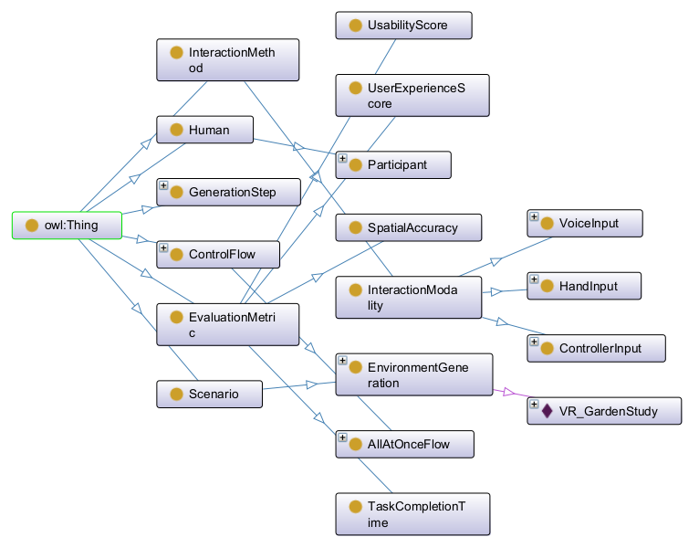

## Ontology Design

Each paper utilizes a custom ontology beyond the combined ontology framework. Below are two ontologies derived from specific research papers, including class structures, properties, and example instances.

---

### 🧠 **Ontology: AI Assistance in Noisy Image Classification**
*Based on:* _"An Empirical Investigation of Reliance on AI-Assistance in a Noisy-Image Classification Task"_ by H. Tejeda Lemus et al.  
**Prefix:** `ai`

#### 📦 Classes
- `AIModel` – An AI classifier/system assisting humans (subclass of `:ArtificialAgent`)
- `AIOffCondition`, `AIOnCondition` – Conditions indicating AI availability
- `Accuracy`, `AutomationBias`, `OptimalReliance`, `ConfidenceRating` – Subclasses of `PerformanceMetric` representing evaluation aspects
- `ClassifierAboveBaseline`, `ClassifierBelowBaseline`, `ClassifierOnBaseline` – AI performance categories
- `ExperimentalCondition` – Experimental setup descriptor
- `NoisyImageClassificationTask` – A decision-making task under uncertainty (subclass of `:InteractionTask`)
- `Participant` – Human subjects
- `PerformanceMetric` – Evaluation metrics for human/AI performance

#### 🔗 Object Properties
- `achievedMetric` – Links `NoisyImageClassificationTask` to a `PerformanceMetric`
- `hasCondition` – Associates a task with `AIOnCondition` or `AIOffCondition`
- `involvesParticipant` – Links task to a `Participant`
- `usesAIModel` – Specifies the `AIModel` used

#### 🔢 Data Properties
- `hasAccuracyValue` – Numeric accuracy (range: `xsd:decimal`)
- `hasAutomationBiasScore` – Float score for automation bias
- `hasConfidenceValue` – Confidence level (float/decimal)
- `hasOptimalRelianceGap` – Deviation from optimal performance (float)

#### 👤 Named Individuals
- `aiAssistancePaper` – The paper entity
- `classifier above baseline`, `on baseline`, `below baseline` – AI performance examples
- `condition ai off`, `condition ai on` – AI availability states
- `participant 001`, `participant 002` – Annotated human participants
- `task p1 t1`, `task p2 t1` – Instances of `NoisyImageClassificationTask`

---

### 🕶️ **Ontology: Generative VR**
*Based on:* _"Computer, Generate! – Investigating User-Controlled Generation of Immersive Virtual Environments"_ by C. Liebers et al.  
**Prefix:** `gv`

#### 📦 Classes
- `AllAtOnceFlow`, `CreationBeforeManipulationFlow`, `StepByStepFlow` – Subclasses of `ControlFlow`, defining generation sequences
- `ColoringStep`, `CreationStep`, `DeletionStep`, `MovementStep`, `ScalingStep` – `GenerationStep` subclasses for each VR action
- `ControlFlow` – Base class for orchestration logic
- `ControllerInput`, `HandInput`, `VoiceInput` – Subclasses of `InteractionModality`
- `EnvironmentGeneration` – Environment generation task (subclass of `:Scenario`)
- `EvaluationMetric`, `SpatialAccuracy`, `TaskCompletionTime`, `UsabilityScore`, `UserExperienceScore` – Evaluation classes
- `GenerationStep` – Steps in the VR object generation process
- `InteractionModality` – Subclass of `:InteractionMethod`
- `Participant` – A `:Human` participant in the VR scenario

#### 🔗 Object Properties
- `achievedResult` – Links generation scenario to `EvaluationMetric`
- `employsGenerationStep` – Connects `EnvironmentGeneration` with specific `GenerationStep`s
- `hasControlFlow` – Specifies the `ControlFlow` used
- `hasModality` – Indicates the interaction method
- `involvesParticipant` – Links scenario to participants

#### 🔢 Data Properties
- `hasRotationError` – Rotational mismatch (`xsd:float`)
- `hasSUSScore` – Usability score (`xsd:float`)
- `hasTimeInSeconds` – Task duration (`xsd:float`)
- `hasTranslationError` – Positional error (`xsd:float`)
- `hasUEQScore` – User experience score (`xsd:float`)

#### 👤 Instances
- `VR GardenStudy` – An `EnvironmentGeneration` instance using multiple generation steps, control flows, and modalities
- `all at once flow`, `creation before manipulation flow`, `step by step flow` – Control flow examples
- `creation step`, `movement step`, `deletion step`, `scaling step`, `coloring step` – Generation steps
- `controller input modality`, `hand input modality`, `voice input modality` – Interaction modalities
- `study participant 001` – A participant object

